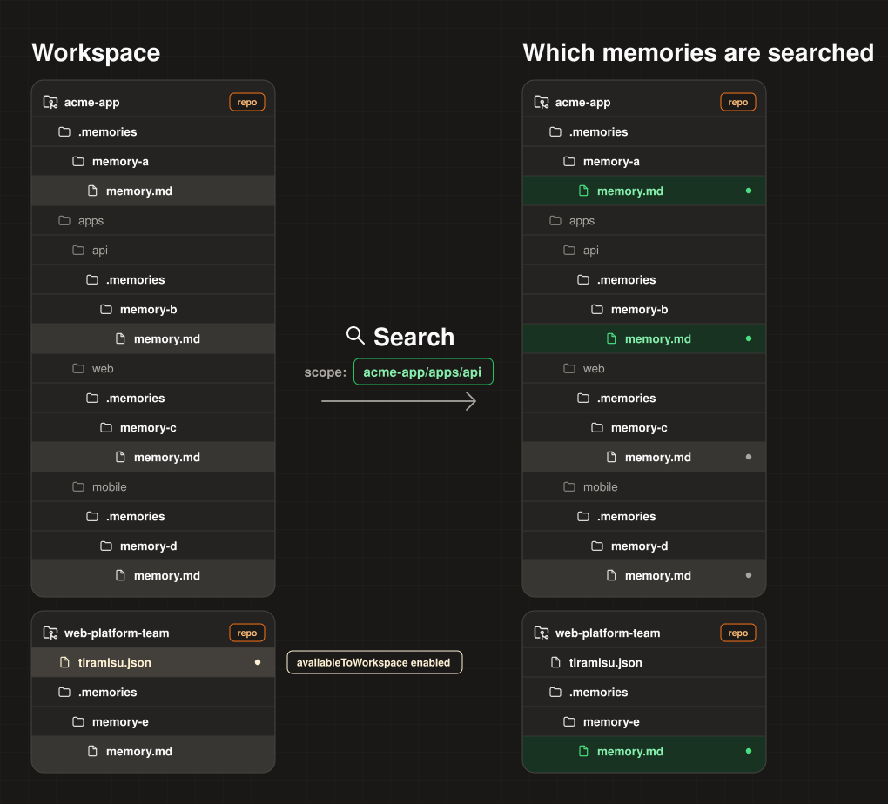
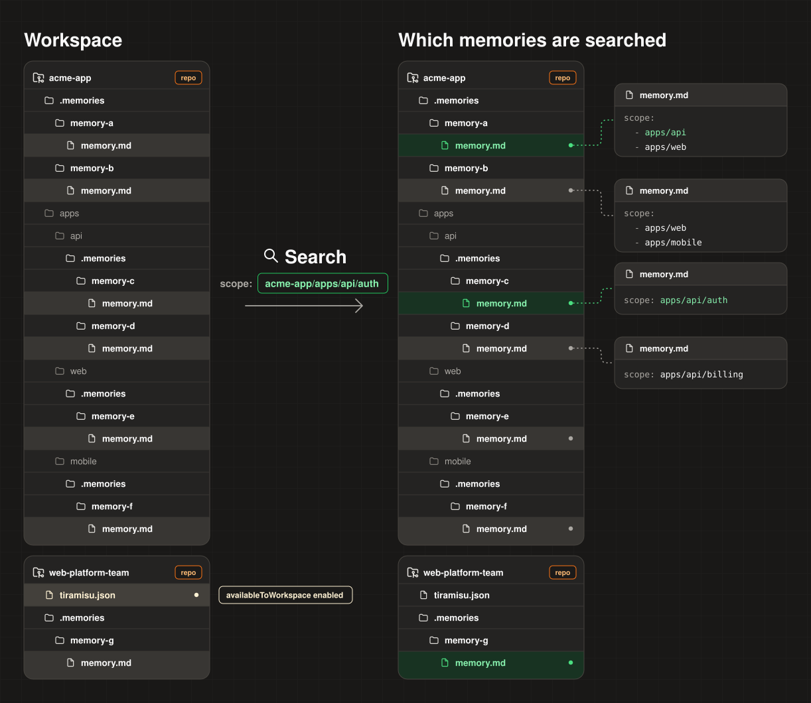

**Tiramisu is a git-native memory system for AI coding agents.**

Tiramisu provides a set of [MCP tools](../02-api-reference/mcp.md) that store **curated context** as **Markdown** files inside your repositories. Tiramisu keeps agent knowledge atomic, version-controlled, and reviewable in pull requests.

## How does search work?

Memories are selected for search using hierarchical path matching: a memory's `scope` must equal, contain, or fall within a searched path. Workspace sharing, enabled through `availableToWorkspace`, also includes memories from other repositories in the workspace. Search then returns memories that match the query.

### Example: Default scopes

Consider the following scenario where `memory.md` files skip defining the `scope` frontmatter field. In this case, the `scope` defaults to their parent package.

### Example: Custom scopes

## Why doesn't Tiramisu use vector search or reranking?

Tiramisu doesn't store every conversation transcript. It stores short, curated memories that are meant to remain useful over time.

Together with [scope](../02-api-reference/memory-format.md#scope), that keeps the search space small. [BM25](https://en.wikipedia.org/wiki/Okapi_BM25) is enough without adding embeddings, vector databases, or reranking.

More advanced search becomes useful when a system stores much larger amounts of noisy data, such as full conversation transcript history. Tiramisu avoids creating that problem in the first place.

## Philosophy

### Knowledge about code must generally have the same lifecycle as the code it describes

Memories are committed alongside the code, reviewed in the same PR, and reverted if the code is reverted.

Decoupled memory storage (external databases or detached background PRs) breaks git atomicity. If a feature branch is abandoned or rolled back, its memory must not linger on `main` to poison future agent runs.

### Clean memories, no transcript hoarding

Store things that matter, like architectural decisions or library quirks.

**Why**: Before AI, engineers never recorded every Google search or 1-on-1 brainstorm meeting. Hoarding long chat transcripts is lazy architecture that leads to massive context pollution and hallucinations, and burns thousands of dollars on useless tokens.

### Allergy to context pollution

The best way to break an AI agent is to give it too much irrelevant context.

**Why**: LLMs suffer from attention dispersion. An agent editing `packages/billing` doesn't need context only relevant to `apps/mobile`.

### Write once, inherit everywhere

**Why**: A developer shouldn't copy-paste their team's guidelines in every single repo.
